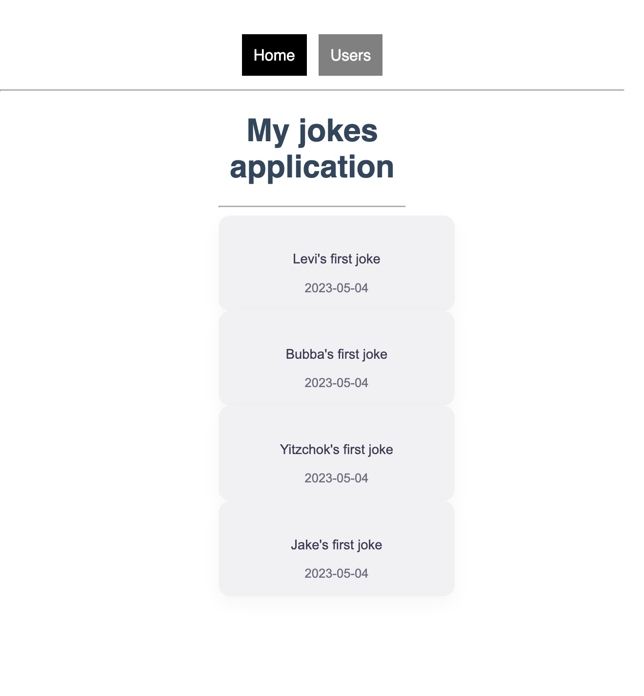
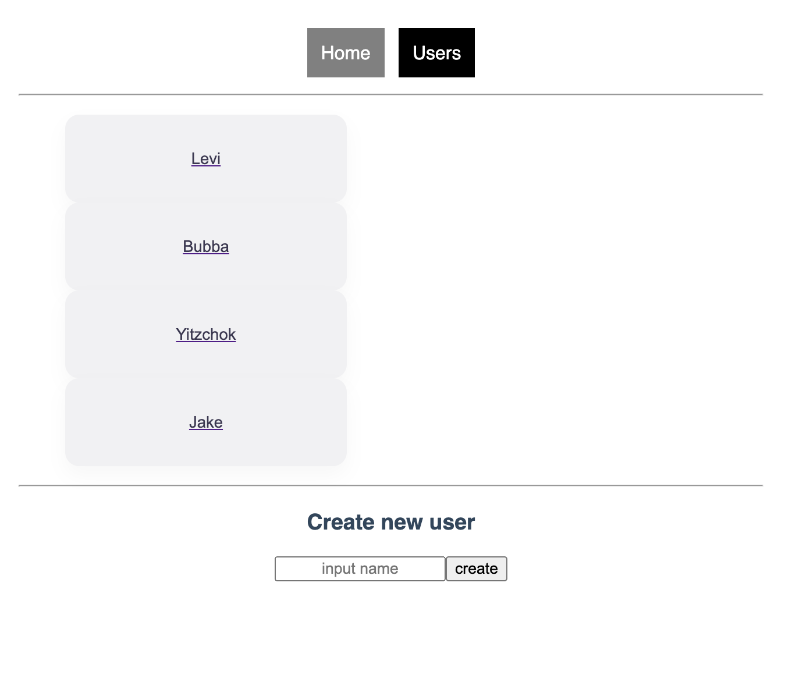

# My phase-3 Project! - My jokes application - frontend

## About:
Have you ever just wanted to hop onto a website where everything about it is just fun?
Well you're in luck because "My jokes application" is a simple way for users to post their latest jokes!

## How to start it up:
Clone the repository and open it in your terminal. 
Run:
 `$ npm install` or `$ npm i`

Then to start the project, run:
`$ npm start` 
You will then be taken to the browser to start using the project.

## IMPORTANT
Make sure the backend server is running as well.
[Backend](https://github.com/learn-co-curriculum/phase-3-sinatra-react-project)

## How to use it:

## Home:

Here we have our Home page with a list of all our users jokes.
On the top half of the page we can navigate from Home to Users.

## Users

Here we have our Users page with a list of all our Users. Click on any user and you will be brought to that specific users page.

The lower half of the Users page allows you to create a new user.

